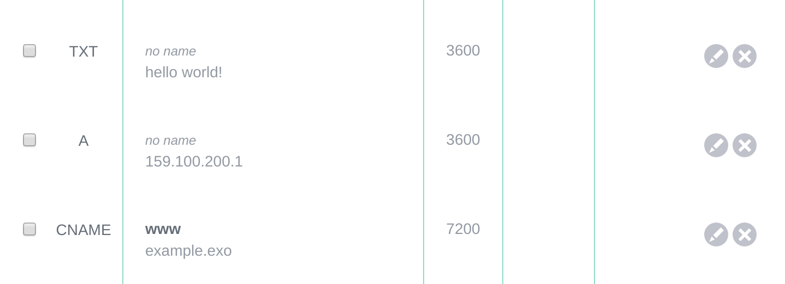

# DNS

This example creats a domain `example.exo` with three records

- **A** so that `example.exo` points to the IPv4 of the instance (`exoscale_compute.<name>.ip_address`)
- **CNAME** to alias `www.example.exo` to `example.exo`
- **TXT** to put a text field

```
$ terraform init

$ terraform apply
```

Then, on the Portal, you should see the following entries.



**NB:** To have [DNS](https://www.exoscale.com/dns/), a subscription is required. Visit the account section in the Portal.
